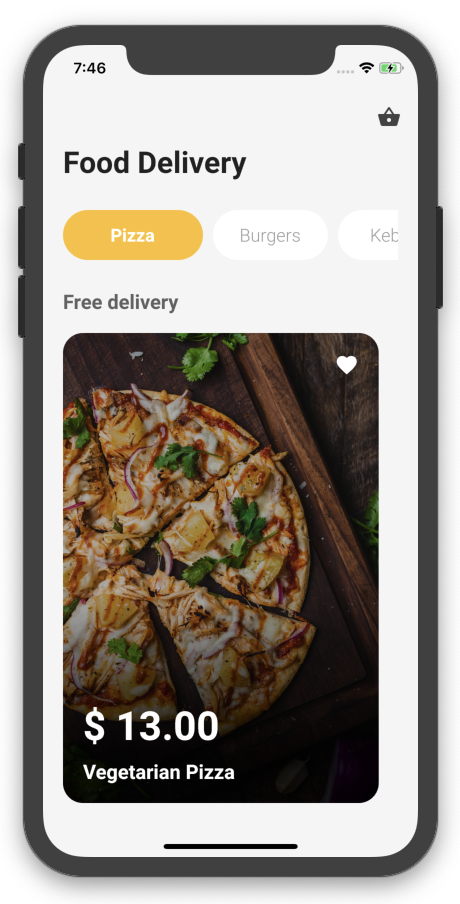

## Flutter Food Delivery Application Design - Day 3


[Watch it on Youtube](https://youtu.be/lff21mmYhvQ)
<br>

## Development Setup
Clone the repository and run the following commands:
```
flutter pub get
flutter run
```


## ScreenShot




## Structure du Projet

**lib/**: Contient le code source de l'application.
  - **main.dart**: Point d'entrée de l'application.

  - **pages/**:
    - **home_page.dart**: Page principale affichant les catégories de nourriture et une liste d'articles.
    - **starter_page.dart**: Page de démarrage avec animations et transition vers la page principale.

  - **animation/**:
    - **fade_animation.dart**: Implémentation de l'animation de fondu utilisée dans l'application.

## Description des fichiers

<details>
<summary>lib/main.dart</summary>

Ce fichier est le point d'entrée principal de l'application Flutter. Il initialise l'application et configure le thème global, les routes et les configurations initiales.

</details>

<details>
<summary>lib/pages/home_page.dart</summary>

Ce fichier contient la définition de la page principale de l'application. Il affiche une liste de catégories de nourriture ainsi que des articles disponibles. La page utilise des animations de fondu pour améliorer l'expérience utilisateur.

- **HomePage**: Un widget Stateful qui représente la page d'accueil de l'application.
  - **categories**: Une liste de catégories de nourriture.
  - **foods**: Une liste d'objets alimentaires avec une image et un indicateur de favori.
  - **selectedCategory**: Indice de la catégorie actuellement sélectionnée.
  - **makeCategory({title, index})**: Une méthode pour créer des widgets de catégorie.
  - **makeItem({image, isFavorite, index})**: Une méthode pour créer des widgets d'articles alimentaires.

</details>

<details>
<summary>lib/pages/starter_page.dart</summary>

Ce fichier contient la définition de la page de démarrage de l'application. La page utilise des animations et transitions pour créer une expérience utilisateur fluide. Elle affiche un message de bienvenue et un bouton pour commencer, qui, une fois cliqué, navigue vers la page principale avec une transition de fondu.

- **StarterPage**: Un widget Stateful qui représente la page de démarrage de l'application.
  - **_animationController**: Un contrôleur d'animation pour gérer les animations.
  - **_animation**: Une animation Tween pour gérer l'échelle d'un widget.
  - **_textVisible**: Un booléen pour contrôler la visibilité du texte.
  - **_onTap()**: Une méthode pour gérer l'action de clic et démarrer l'animation de transition vers la page d'accueil.

</details>

<details>
<summary>lib/animation/fade_animation.dart</summary>

Ce fichier contient l'implémentation de l'animation de fondu utilisée dans l'application. Il utilise le package `simple_animations` pour créer des effets de transition doux.

- **FadeAnimation**: Un widget Stateless qui applique une animation de fondu à son enfant.
  - **delay**: Le délai avant de démarrer l'animation.
  - **child**: Le widget enfant auquel l'animation sera appliquée.
  - **MovieTween**: Définition des animations de transparence et de translation.

</details>
